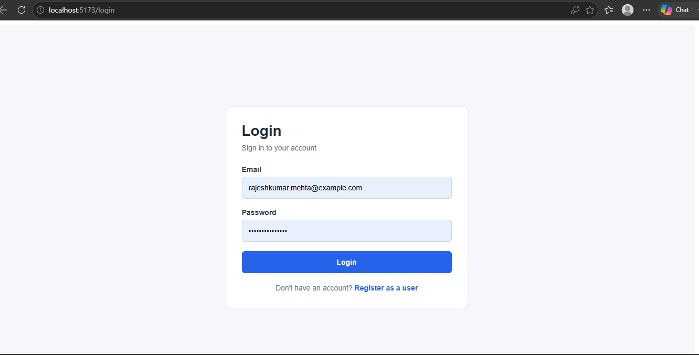
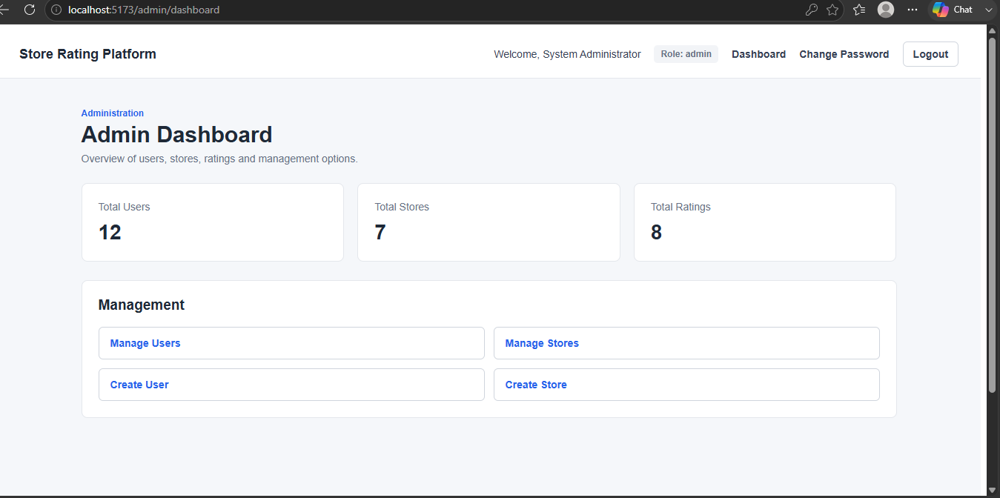
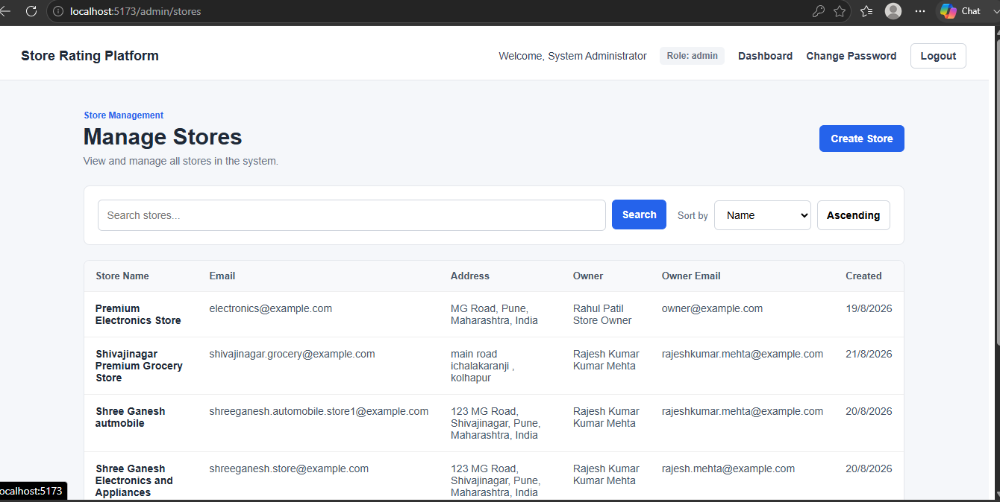
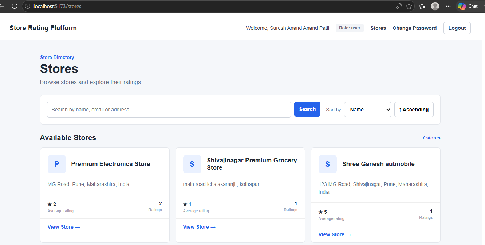
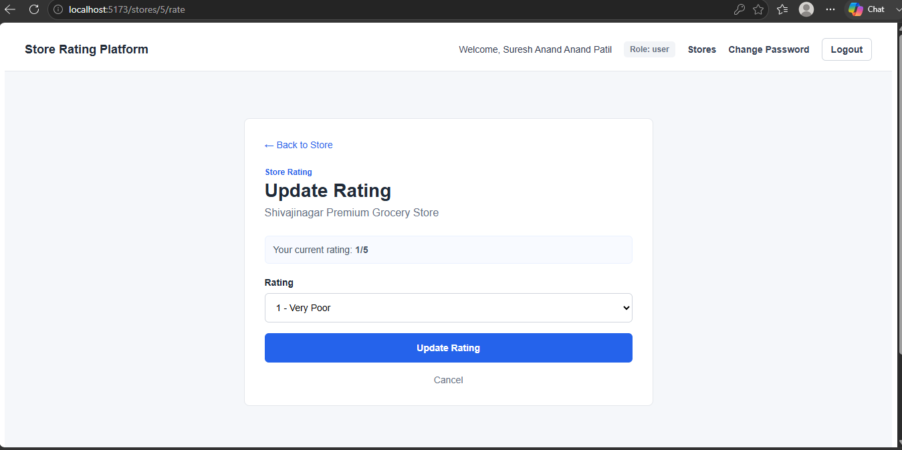
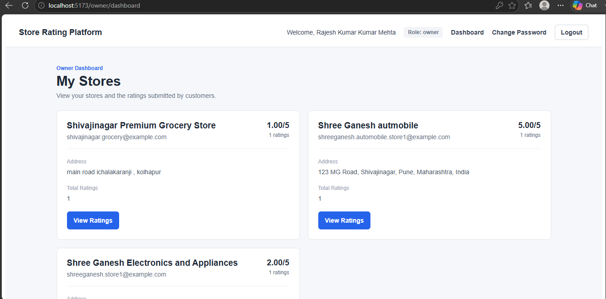

# Store Rating Platform

A full-stack web application that allows users to discover stores, submit ratings, and manage their ratings, with dedicated functionality for administrators and store owners.

## Project Overview

The Store Rating Platform is a role-based full-stack web application designed to manage stores and their ratings.

The application supports three user roles:

- **Admin** — manages users and stores and has access to system-level dashboard information.
- **Store Owner** — manages and monitors their owned stores and can view ratings submitted by users.
- **Normal User** — can browse stores, view ratings, and submit or update their own ratings.

The application uses JWT-based authentication and role-based authorization to ensure that users can only access functionality permitted for their role.

The backend follows a separation-of-concerns architecture with dedicated routes, controllers, services, middleware, and validation layers. The frontend is built with React and provides role-specific pages and dashboards.


## Features

### Admin

- Secure admin login
- View dashboard statistics
- View and manage users
- Search users
- Filter users by role
- Sort users by supported fields
- View user details
- Create users
- Create store owners
- Create stores
- Assign stores to store owners
- View and manage stores
- Search stores
- Sort stores by supported fields
- Delete users
- Change password

### Store Owner

- Secure owner login
- View owner dashboard
- View stores owned by the logged-in owner
- View average rating for each owned store
- View total number of ratings
- View ratings submitted for owned stores
- View users who submitted ratings
- Change password

### Normal User

- Register an account
- Secure login
- View available stores
- Search stores
- View store details
- View overall store rating
- View their own rating for a store
- Submit a rating from 1 to 5
- Update an existing rating
- Change password
- Logout

### Security & Validation

- JWT-based authentication
- Role-based authorization
- Protected API routes
- Request validation
- Password hashing
- Unauthorized access handling
- Database-level constraints for ratings


## Screenshots

### Login



### Admin Dashboard



### Admin Store Management



### Store Listing



### Rate Store



### Owner Dashboard




## Tech Stack

### Frontend

- React
- React Router
- Axios
- CSS
- Vite

### Backend

- Node.js
- Express.js
- JWT
- bcrypt
- MySQL

### Development & Testing

- Postman
- MySQL
- Git / GitHub


## Project Structure

```text
store-rating-portal/
│
├── client/
│   ├── public/
│   ├── src/
│   │   ├── api/
│   │   ├── assets/
│   │   ├── components/
│   │   ├── context/
│   │   ├── pages/
│   │   ├── routes/
│   │   ├── styles/
│   │   ├── App.jsx
│   │   ├── App.css
│   │   ├── index.css
│   │   └── main.jsx
│   ├── package.json
│   ├── vite.config.js
│   └── index.html
│
├── server/
│   ├── src/
│   │   ├── config/
│   │   ├── controllers/
│   │   ├── middleware/
│   │   ├── routes/
│   │   ├── seeders/
│   │   ├── services/
│   │   ├── utils/
│   │   └── validators/
│   ├── app.js
│   ├── .env.example
│   └── package.json
│
├── database/
├── screenshots/
├── .gitignore
└── README.md


## Database Schema

The application uses MySQL with three main tables: `users`, `stores`, and `ratings`.

### Users

Stores authentication and role information for all users.

| Column | Description |
|---|---|
| `id` | Primary key |
| `name` | User's name |
| `email` | Unique email address |
| `password` | Hashed password |
| `address` | User's address |
| `role` | `admin`, `user`, or `owner` |
| `created_at` | Account creation timestamp |
| `updated_at` | Last update timestamp |

### Stores

Stores information about registered stores and their owners.

| Column | Description |
|---|---|
| `id` | Primary key |
| `name` | Store name |
| `email` | Unique store email |
| `address` | Store address |
| `owner_id` | Foreign key referencing `users.id` |
| `created_at` | Store creation timestamp |
| `updated_at` | Last update timestamp |

### Ratings

Stores ratings submitted by normal users.

| Column | Description |
|---|---|
| `id` | Primary key |
| `user_id` | Foreign key referencing `users.id` |
| `store_id` | Foreign key referencing `stores.id` |
| `rating` | Rating value from 1 to 5 |
| `created_at` | Rating creation timestamp |
| `updated_at` | Last update timestamp |

### Relationships

- A user can own multiple stores.
- A store belongs to a store owner.
- A user can submit ratings for multiple stores.
- A store can receive ratings from multiple users.
- Each user can have only one rating for a particular store.
- Deleting a user removes their associated ratings.
- Deleting a store removes its associated ratings.

The database enforces the one-rating-per-user-per-store rule using a unique constraint on:

```text
(user_id, store_id)


## Environment Variables

The backend uses environment variables for database configuration and JWT authentication.

Create a `.env` file inside the `server` directory based on `.env.example`:

```env
PORT=5000

DB_HOST=localhost
DB_USER=root
DB_PASSWORD=your_mysql_password
DB_NAME=store_rating_portal
DB_PORT=3306

JWT_SECRET=replace_with_a_secure_random_secret


## Installation & Setup

### Prerequisites

Make sure the following are installed:

- Node.js
- npm
- MySQL
- Git

### 1. Clone the Repository

```bash
git clone https://github.com/Shree9972/store-rating-portal.git
cd store-rating-portal
```

### 2. Database Setup

Create the MySQL database:

```sql
CREATE DATABASE store_rating_portal;
```

Run the database schema from:

```text
database/schema.sql
```

The schema creates the following tables:

- `users`
- `stores`
- `ratings`

### 3. Backend Setup

Navigate to the server directory:

```bash
cd server
```

Install dependencies:

```bash
npm install
```

Create a `.env` file using `.env.example` as a template and configure the database and JWT settings.

#### Start the Backend in Development Mode

```bash
npm run dev
```

This runs the backend using Nodemon.

#### Start the Backend Normally

```bash
npm start
```

The backend runs on:

```text
http://localhost:5000
```

#### Seed the Initial Admin

To create the initial administrator account, run:

```bash
npm run seed:admin
```

### 4. Frontend Setup

Open another terminal and navigate to the client directory:

```bash
cd client
```

Install dependencies:

```bash
npm install
```

Start the frontend development server:

```bash
npm run dev
```

The frontend will be available at the URL displayed by Vite, normally:

```text
http://localhost:5173
```

### 5. Running the Application

Run both servers simultaneously:

```text
Frontend
http://localhost:5173
        ↓
Backend API
http://localhost:5000
        ↓
MySQL Database
```

## Authentication & Authorization

The application uses JWT-based authentication and role-based authorization.

### Authentication Flow

1. A user registers or logs in through the frontend.
2. The backend validates the submitted credentials.
3. The user's password is securely hashed and compared using `bcrypt`.
4. After successful authentication, the backend generates a JWT.
5. The frontend stores the authenticated user state and includes the JWT in protected API requests.
6. The backend verifies the JWT before allowing access to protected resources.

### User Roles

The application supports three roles:

| Role | Access |
|---|---|
| `admin` | User management, store management, dashboard and administrative operations |
| `owner` | Owner dashboard, owned stores and ratings for owned stores |
| `user` | Store browsing, viewing ratings, and submitting/updating ratings |

### Role-Based Authorization

Protected routes use authentication and authorization middleware.

For example:

```text
authenticate
    ↓
Verify JWT
    ↓
Attach authenticated user to request
    ↓
authorize("admin")
    ↓
Check user's role
    ↓
Allow or reject request
```

Unauthorized requests return appropriate HTTP status codes:

- `401 Unauthorized` — authentication is missing or invalid.
- `403 Forbidden` — the authenticated user does not have permission to access the resource.

Role checks are performed on the backend, so frontend route protection is not relied upon as the primary security mechanism.